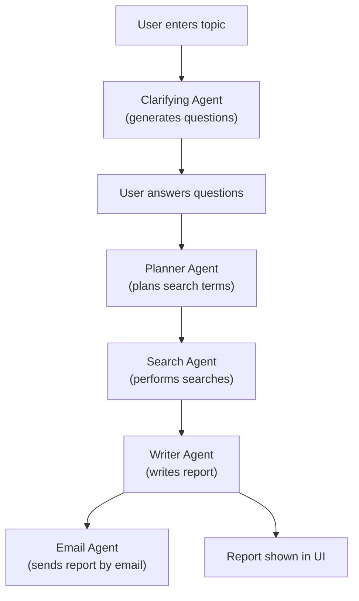

# Deep Research App

## Overview

**Deep Research** is an AI-powered research assistant that helps you perform in-depth research on any topic. The app:
- Asks clarifying questions about your research topic,
- Plans relevant web searches,
- Gathers and summarizes information,
- And emails the information to you.

All of this is done through a simple web interface.

---

## Features

- **Clarifying Agent:** Asks follow-up questions to better understand your research intent.
- **Planner Agent:** Plans the best search terms and subtopics.
- **Search Agent:** Performs web searches and summarizes results.
- **Writer Agent:** Writes a detailed, structured report.
- **Email Agent:** Sends the report to your email, although the report is shown in UI also. 

---

## Installation

1. **Clone the repository:**
   ```sh
   git clone https://github.com/EorlEli/deep-research.git
   cd deep_research
   ```

2. **Create and activate a virtual environment (optional but recommended):**
   ```sh
   python -m venv .venv
   # On Unix/macOS:
   source .venv/bin/activate
   # On Windows:
   .venv\Scripts\activate
   ```

3. **Install dependencies:**
   ```sh
   pip install -r requirements.txt
   ```

4. **Set up environment variables:**
   - Create a `.env` file in the project root.
   - Add your OpenAI API key and SendGrid API key:
     ```
     OPENAI_API_KEY=your-openai-key
     SENDGRID_API_KEY=your-sendgrid-key
     ```

---

## Usage

1. **Run the app:**
   ```sh
   uv run deep_research.py
   ```
   or
   ```sh
   python deep_research.py
   ```

2. **Open the web interface:**
   - The app will open in your browser automatically.
   - If not, go to the URL shown in the terminal (usually http://localhost:7860).

3. **How to use:**
   - Enter your research topic and click **Next: Clarify**.
   - Answer the clarifying questions.
   - Click **Run Research** to generate your report.
   - The report will be displayed and sent to your email.

---

## Visual Workflow



---

## Configuration

- **Email sending:**  
  Edit `email_agent.py` to set your sender and recipient email addresses.
  The email agent sends notifications from the author's push notification email to another author's email address by default. **You should change both the sender and recipient addresses in `email_agent.py` to your own, so that I do not receive other people's reports in ny email inbox :-).**
- **Number of clarifying questions:**  
  The clarifying agent generates up to 4 questions by default.

---

## Project Structure

```
deep_research/
├── clarifying_agent.py
├── planner_agent.py
├── search_agent.py
├── writer_agent.py
├── email_agent.py
├── research_manager.py
├── deep_research.py
├── requirements.txt
└── .env
```

---


## Acknowledgments

- Built with [Gradio](https://gradio.app/) for the UI.
- Uses [OpenAI](https://openai.com/) for language models.
- Uses [SendGrid](https://sendgrid.com/) for email delivery. 
